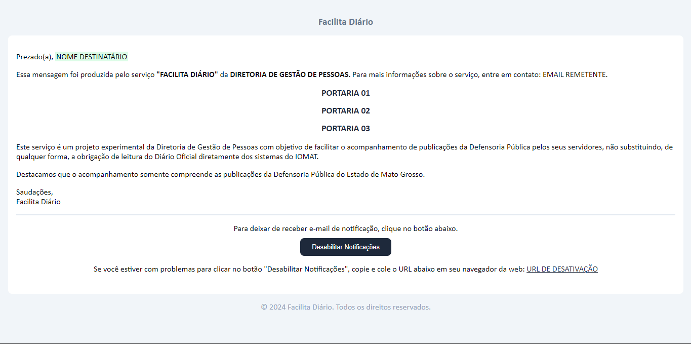

# Email de Notificação

<!-- ## Modelo (E-mail Notificação)

 -->

## Como Funciona?

### Envio da Notificação

Para configurar o envio de notificações, é necessário definir as variáveis de ambiente no arquivo `.env`:


```
MAIL_MAILER=
MAIL_HOST=
MAIL_PORT=
MAIL_USERNAME=
MAIL_PASSWORD=
MAIL_ENCRYPTION=
MAIL_FROM_ADDRESS="${MAIL_USERNAME}"
MAIL_FROM_NAME="${APP_NAME}"
```

Toda a lógica do servidor é estruturada conforme o padrão Model View Controller [(MVC)](https://pt.wikipedia.org/wiki/MVC). Nesse modelo, a view faz requisições [HTTP](https://developer.mozilla.org/pt-BR/docs/Web/HTTP) para o controller, que então processa a lógica de negócios e interage com os dados do modelo para fornecer a resposta adequada.

Para que os dados sejam recebidos pelo servidor, são utilizadas rotas específicas definidas para essa finalidade. Todas as rotas estão localizadas no diretório [routes](https://github.com/Luis-F-Oliveira/fc-server/tree/main/routes). As rotas relacionadas à Interface de Programação de Aplicação [(API)](https://aws.amazon.com/pt/what-is/api/#:~:text=API%20significa%20Application%20Programming%20Interface,de%20servi%C3%A7o%20entre%20duas%20aplica%C3%A7%C3%B5es.) podem ser encontradas em [`api.php`](https://github.com/Luis-F-Oliveira/fc-server/blob/main/routes/api.php), que é o caso atual.

```php	
<?php

use App\Http\Controllers\NotifyController;
use Illuminate\Support\Facades\Route;

Route::post('send_emails', [NotifyController::class, 'sendEmail']);
```

O sistema descrito é responsável por criar uma rota que, ao receber uma requisição HTTP POST, processa um [array](https://pt.wikipedia.org/wiki/Arranjo_(computa%C3%A7%C3%A3o)) contendo chaves primárias da [tabela `data`](../database/tabelas.md#data).

Após receber os dados enviados pelo cliente, eles serão encaminhados para o método `sendEmail` do controller [`NotifyController`](https://github.com/Luis-F-Oliveira/fc-server/blob/main/app/Http/Controllers/NotifyController.php).

```php
public function sendEmail(Request $request)
{
  $data = Data::with('servant')->find($request);

  if (!$data) {
    return response()->json(['message' => 'Dados não encontrados'], 404);
  }

  $groupedData = [];
  foreach ($data as $item) {
    $servantId = $item->servant_id;
    if (!isset($groupedData[$servantId])) {
      $groupedData[$servantId] = [];
    }
    $groupedData[$servantId][] = $item;
  }

  foreach ($groupedData as $servantId => $items) {
    $servant = $items[0]->servant;
    $email = $servant->email;
    $apiUrl = $this->generatePermissionUrl($email);

    if ($servant->active) {
      Mail::to($email)->send(new SendCollectedData($items, $servant, $apiUrl));
      continue;
    }
  }

  return response()->json(['message' => 'E-mails enviados com sucesso'], 200);
}
```

Inicialmente esse método tem como objetivo coletar os dados salvos a partir do modelo [`\App\Models\Data`](https://github.com/Luis-F-Oliveira/fc-server/blob/main/app/Models/Data.php), o qual retorna uma lista de objetos.

```json
[
  {
    "order",
    "url",
    "servant_id",
    "servant": {
      "enrollment",
      "contract",
      "name",
      "email",
      "active"
    }
  },
  ...
]
```

Após receber os dados, o método os organiza em uma nova lista para garantir que sejam enviados de forma estruturada. Em seguida, os dados são encaminhados para o sistema de envio gerenciado pelo [facade](https://laravel.com/docs/11.x/facades#main-content) Mail. Este facade utiliza as classes responsáveis pelo envio de e-mails, sendo, no nosso caso, a classe [`SendCollectedData`](https://github.com/Luis-F-Oliveira/fc-server/blob/main/app/Mail/SendCollectedData.php).

```php
<?php

namespace App\Mail;

use App\Models\Servants;
use Illuminate\Bus\Queueable;
use Illuminate\Contracts\Queue\ShouldQueue;
use Illuminate\Mail\Mailable;
use Illuminate\Mail\Mailables\Content;
use Illuminate\Mail\Mailables\Envelope;
use Illuminate\Queue\SerializesModels;

class SendCollectedData extends Mailable
{
  use Queueable, SerializesModels;

  /**
   * Create a new message instance.
   */
  public function __construct(
    protected array $collectedData,
    protected Servants $servant,
    protected string $api
  ) {}

  /**
   * Get the message envelope.
   */
  public function envelope(): Envelope
  {
    return new Envelope(
      subject: 'Notificação Facilita Diário',
    );
  }

  /**
   * Get the message content definition.
   */
  public function content(): Content
  {
    $uniqueData = collect($this->collectedData)->unique('order')->toArray();

    return new Content(
      view: 'emails.data',
      with: [
        'groupedData' => $uniqueData,
        'servant' => $this->servant,
        'apiUrl' => $this->api
      ]
    );
  }

  /**
   * Get the attachments for the message.
   *
   * @return array<int, \Illuminate\Mail\Mailables\Attachment>
   */
  public function attachments(): array
  {
    return [];
  }
}
```

De forma resumida, essa classe recebe os dados através de seu construtor e retorna um e-mail completo. Cada parte do e-mail é gerada por métodos específicos: o método `envelope` define o assunto, enquanto o método `content` cria o conteúdo do e-mail.

Agora que entendemos o processo de coleta de dados e envio de e-mails, vamos ver como o arquivo que modela o e-mail é criado para gerenciar o corpo da mensagem. Esse arquivo define o conteúdo principal do e-mail, incluindo textos, imagens e links, e permite a personalização dinâmica de informações específicas, como o nome do destinatário ou detalhes da notificação. Ele garante que o corpo do e-mail seja formatado corretamente, aplicando estilos e layouts padronizados, para proporcionar uma comunicação clara e eficaz com o usuário.

A formatação do corpo do e-mail é realizada utilizando o arquivo próprio do Laravel, chamado [Blade](https://laravel.com/docs/11.x/blade#main-content). Esse arquivo permite trabalhar com [HTML](https://developer.mozilla.org/pt-BR/docs/Web/HTML) e [PHP](https://pt.wikipedia.org/wiki/PHP) de maneira integrada, sem a necessidade de separar constantemente as duas linguagens, o que torna o desenvolvimento mais ágil e eficiente. Dessa forma, o Blade facilita o mapeamento dos dados enviados pela classe SendCollectedData, permitindo que o conteúdo do e-mail seja dinâmico e personalizável de acordo com as necessidades da aplicação.


```html
<!DOCTYPE html>
<html lang="pt-br">

<head>
  <meta charset="UTF-8">
  <meta name="viewport" content="width=device-width, initial-scale=1.0">
  <title>Document</title>
</head>

<body style="padding: 0px; margin: 0px; outline: 0px; box-sizing: border-box; font-family: 'Gill Sans', 'Gill Sans MT', Calibri, 'Trebuchet MS', sans-serif; background-color: #f1f5f9; width: 100%; height: 100%;">

  <table align="center" width="100%" cellpadding="0" cellspacing="0" style="background-color: #f1f5f9; padding: 1rem;">
    <tr>
      <td style="text-align: center; font-weight: bold; font-size: 1.2rem; background-color: #f1f5f9; border-radius: 0.5rem; padding: 1rem; max-width: 33%; margin: auto; color: #64748b;">
        {{ env('APP_NAME') }}
      </td>
    </tr>
    <tr>
      <td style="padding: 1rem; background-color: #ffffff; border-radius: 0.5rem; margin: auto;">
        <p>
          Prezado(a),
          <span style="background-color: #dcfce7; padding: 0 2px;">
            {{ $servant['name'] }}
          </span>
        </p>
        <p>
          Essa mensagem foi produzida pelo serviço <strong>"FACILITA DIÁRIO"</strong> da
          <strong>DIRETORIA DE GESTÃO DE PESSOAS.</strong> Para mais informações sobre o serviço,
          entre em contato: {{ config('mail.from.address') }}.
        </p>
        <ul style="list-style: none; padding: 0; text-align: center;">
          @foreach ($groupedData as $data)
          <li style="margin-bottom: 0.8rem;">
            <a href="{{ $data['url'] }}" target="_blank" style="text-decoration: none; color: #1e293b;">
              <h1 style="font-size: 1.1rem; margin: 0;">{{ $data['order'] }}</h1>
            </a>
          </li>
          @endforeach
        </ul>
        <p>
          Este serviço é um projeto experimental da Diretoria de Gestão de Pessoas com objetivo de facilitar o
          acompanhamento de publicações da Defensoria Pública pelos seus servidores, não substituindo, de qualquer forma,
          a obrigação de leitura do Diário Oficial diretamente dos sistemas do IOMAT.
        </p>
        <p>
          Destacamos que o acompanhamento somente compreende as publicações da Defensoria Pública do Estado de Mato
          Grosso.
        </p>
        <p>
          Saudações, <br>
          {{ env('APP_NAME') }}
        </p>
        <hr style="border: 1px solid #e2e8f0; margin: 0.8rem 0;">
        <div style="text-align: center; margin-bottom: 1.5rem;">
          <p style="margin-bottom: 10px;">
            Para deixar de receber e-mail de notificação, clique no botão abaixo.
          </p>
          <a href="{{ $apiUrl }}" style="text-decoration: none; cursor: pointer;">
            <button style="width: 180px; height: 35px; background-color: #1e293b; border-radius: 0.5rem; border: 0; color: #ffffff; font-size: 0.8rem; transition: 1s; display: inline-block;">
              Desabilitar Notificações
            </button>
          </a>
          <p>
            Se você estiver com problemas para clicar no botão "Desabilitar Notificações", copie e cole o URL abaixo em seu
            navegador da web: <a href="{{ $apiUrl }}" style="color: #1e293b;">
              {{ $apiUrl }}
            </a>
          </p>
        </div>
      </td>
    </tr>
    <tr>
      <td style="text-align: center; color: #94a3b8; padding: 1rem;">
        © 2024 {{ env('APP_NAME') }}. Todos os direitos reservados.
      </td>
    </tr>
  </table>

</body>

</html>
```


### Desativar Notificação

Conforme explicado em [tabelas.md](../database/tabelas.md#servants), a tabela `servants` possui uma coluna chamada `activate`, que gerencia quem deve ou não ser notificado pelo sistema. Esse valor pode ser ativado ou desativado de duas formas: diretamente no aplicativo Facilita Diário ou através do e-mail de notificação.

Para permitir a desativação pelo e-mail, é gerado um link especial que realiza essa função com um simples clique, possibilitando a modificação do valor de forma prática e imediata. A seguir, veremos como é feita a criação dessa URL personalizada.

O corpo da URL personalizada inclui alguns dados importantes a serem analisados: `app.url`, `token` e `email`.

O valor de app.url é obtido a partir do arquivo de configuração [`app.php`](https://github.com/Luis-F-Oliveira/fc-server/blob/main/config/app.php). Este arquivo contém várias configurações para a aplicação, e a URL base é definida na chave `'url' => env('APP_URL', 'http://localhost')`. Isso significa que o valor é buscado na variável de ambiente `APP_URL`. Caso essa variável não esteja definida, a configuração padrão retornada é `'http://localhost'`.

O `token` tem um sistema mais complexo, que começa com a definição de uma interface [`TokenGenerator`](https://github.com/Luis-F-Oliveira/fc-server/blob/main/app/Contracts/TokenGenerator.php). Esta interface especifica a criação de um método público chamado `generateToken()`. A principal responsabilidade deste método é retornar uma string, que será o token gerado. A interface serve como um contrato para qualquer classe que a implemente, garantindo que o método `generateToken()` esteja disponível e produza uma string, independentemente da implementação específica.

```php
<?php

namespace App\Contracts;

interface TokenGenerator
{
  public function generateToken(): string;
}
```

Depois disso, criamos um serviço chamado [`RandomTokenGenerator`](https://github.com/Luis-F-Oliveira/fc-server/blob/main/app/Services/RandomTokenGenerator.php) que implementa a interface `TokenGenerator`. Este serviço fornece a implementação concreta do método `generateToken()` definido na interface.

O serviço `RandomTokenGenerator` é responsável por gerar um token aleatório de 32 caracteres alfanuméricos. Para isso, ele utiliza a classe `Str` do Laravel, que facilita a criação de strings aleatórias. Essa abordagem assegura que o token gerado seja único e seguro para suas necessidades.

```php
<?php

namespace App\Services;

use Illuminate\Support\Str;
use App\Contracts\TokenGenerator;

class RandomTokenGenerator implements TokenGenerator
{
  public function generateToken(): string 
  {
    return Str::random(32);
  }
}
```

Para concluir a configuração do método `generateToken()`, criamos um Service Provider chamado [`AppServiceProvider`](https://github.com/Luis-F-Oliveira/fc-server/blob/main/app/Providers/AppServiceProvider.php). O propósito de um Service Provider no Laravel é registrar e configurar serviços e bindings na aplicação.

No caso do `AppServiceProvider`, ele é utilizado para vincular a interface `TokenGenerator` à implementação `RandomTokenGenerator`. Isso garante que sempre que a aplicação precisar de uma instância de `TokenGenerator`, ela receberá um objeto `RandomTokenGenerator`. Essa configuração centraliza a definição de dependências e facilita a manutenção e a substituição de implementações conforme necessário.

```php
<?php

namespace App\Providers;

use App\Contracts\TokenGenerator;
use App\Services\RandomTokenGenerator;
use Illuminate\Support\ServiceProvider;

class AppServiceProvider extends ServiceProvider
{
  /**
   * Register any application services.
   */
  public function register(): void
  {
    $this->app->bind(TokenGenerator::class, RandomTokenGenerator::class);
  }

  /**
   * Bootstrap any application services.
   */
  public function boot(): void
  {
    //
  }
}
```

Com a configuração do método `generateToken()` concluída, agora utilizamos esse método no controller [`NotifyController`](https://github.com/Luis-F-Oliveira/fc-server/blob/main/app/Http/Controllers/NotifyController.php). Dentro deste controller, o método `generatePermissionUrl()` é responsável por criar a URL personalizada contendo todos os dados necessários.


```php
<?php

namespace App\Http\Controllers;

use App\Contracts\TokenGenerator;
use App\Models\HandleNotifications;
use Illuminate\Support\Carbon;

class NotifyController extends Controller
{
  protected $tokenGenerator;

  public function __construct(TokenGenerator $tokenGenerator)
  {
    $this->tokenGenerator = $tokenGenerator;
  }

  private function generatePermissionUrl(string $email): string
  {
    $existingRecord = HandleNotifications::where('email', $email)->first();

    if ($existingRecord) {
      $token = $existingRecord->token;
    } else {
      $token = $this->tokenGenerator->generateToken();

      HandleNotifications::create([
        'email' => $email,
        'token' => $token,
        'created_at' => Carbon::now()
      ]);
    }

    return config('app.url') . "/disable_notification/$token?email=$email";
  }

  ...
}
```

Com a criação da URL que permite ao destinatário do e-mail desativar os envios recorrentes concluída, o próximo passo é abordar o recebimento da requisição e o gerenciamento do token.

Vamos explorar como o sistema processa a requisição quando o destinatário clica no link de desativação, e como o token é validado e utilizado para atualizar o status das notificações. Essa etapa envolve verificar o token, garantir sua validade e, com base nisso, modificar as configurações de envio de notificações para o endereço de e-mail correspondente.

Vamos começar examinando a rota definida no diretório [routes](https://github.com/Luis-F-Oliveira/fc-server/tree/main/routes), especificamente no arquivo [`web.php`](https://github.com/Luis-F-Oliveira/fc-server/blob/main/routes/web.php), que é responsável pelo roteamento interno da aplicação.

```php
<?php

use App\Http\Controllers\DesactivateNotification;
use Illuminate\Support\Facades\Route;

Route::get('disable_notification/{token}', [DesactivateNotification::class, 'index']);
```

Essa rota tem a finalidade de capturar o `token` da URL e encaminhá-lo para o método `index` do controller [`DesactivateNotification`](https://github.com/Luis-F-Oliveira/fc-server/blob/main/app/Http/Controllers/DesactivateNotification.php). O método `index` será responsável por processar o `token`, realizar a validação necessária e atualizar as configurações de notificação conforme solicitado.

```php
<?php

namespace App\Http\Controllers;

use App\Mail\DesactivateNotify;
use App\Models\HandleNotifications;
use App\Models\Servants;
use Illuminate\Http\Request;
use Illuminate\Support\Facades\Mail;

class DesactivateNotification extends Controller
{
  public function index(Request $request, string $token)
  {
    $email = $request->query('email');
    $permission = HandleNotifications::where('token', $token)->first();

    if ($permission) {
      $permission->delete();

      $servant = Servants::where('email', $email)->first();
      $servant->update([
          'active' => false
      ]);

      Mail::to($email)->send(new DesactivateNotify());
    }

    return response()->make('<script>window.close();</script>', 200, ['Content-Type' => 'text/html']);
  }
}
```

No controller, observamos que dois parâmetros são requisitados: o `$request`, que é uma instância da classe `Request` do Laravel, e o `$token`, que é obtido diretamente da rota. O `$request` é utilizado para coletar o e-mail que foi enviado como parâmetro na `URL (...?email=$email)`, enquanto o `$token` é extraído da rota para validação e processamento.

